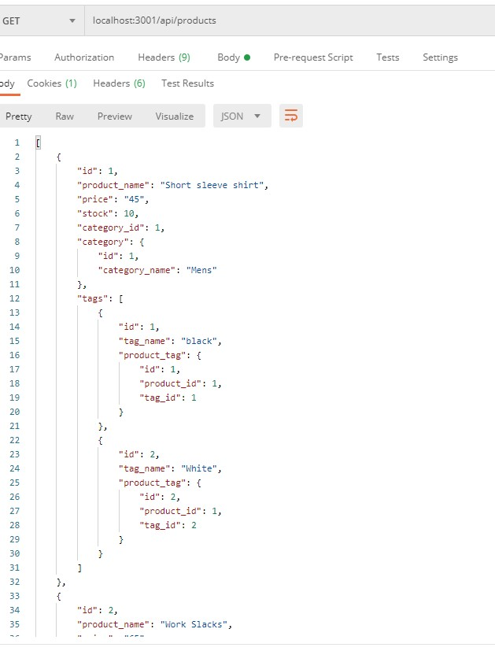

# E-commerce Back End Database

## Overview

I created a back end data base for a retail store using Sequelize, My SQL, and Express.  
This database has categories, tags and Products to organize the inventory for a store.  The products belong to a Category, and have many tags.
the Categories can have many products.  There are many products per tag and they are related through ProductTags.

## Installation and Use

Since there is no frontend to this project to use it you must open it in VS code and run NPM install making sure mysql2, sequelize and express all download.  You can then run an npm start and test the endpoints in either Insomnia or Postman.  You can also view a video of me testing the endpoints below:

https://drive.google.com/file/d/1eoKy0_FC_bccoavqGfwOsJrd_HXubgWd/view